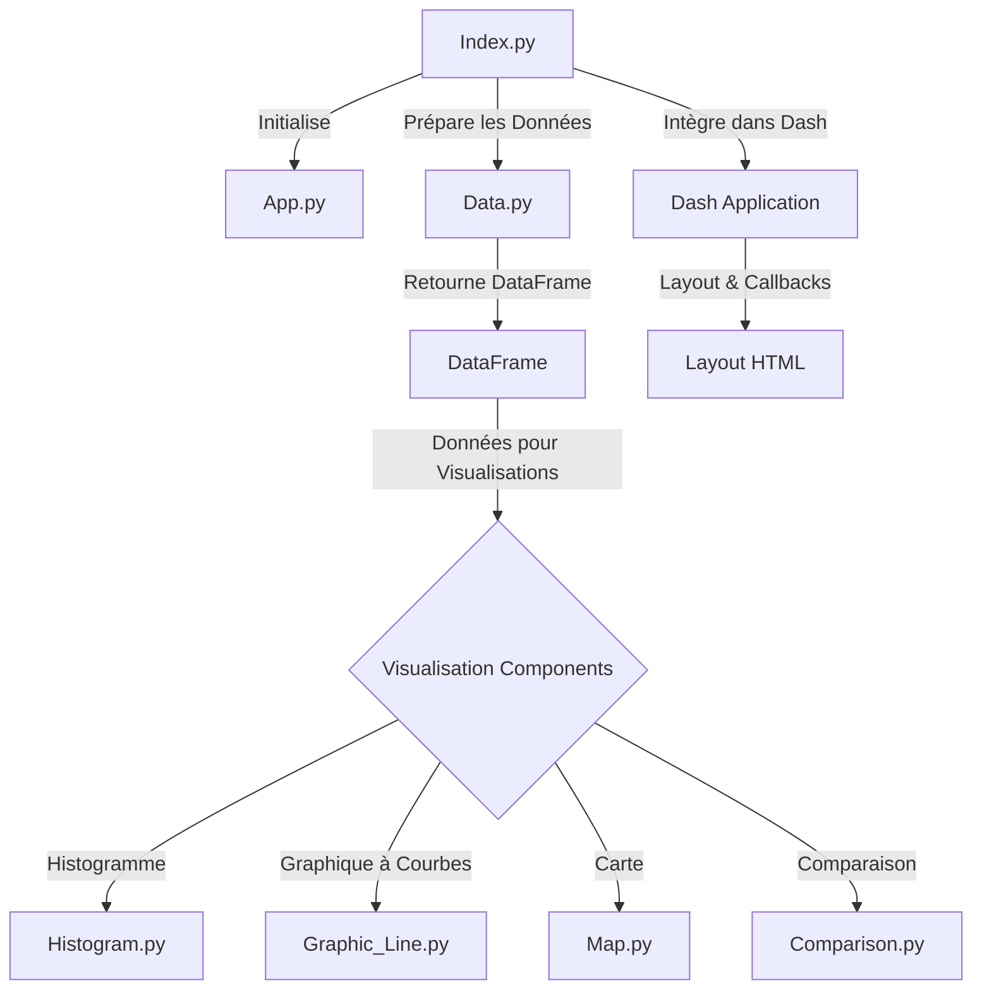

# README pour le Dashboard 

## Guide de l'Utilisateur

### Déploiement du Dashboard

Pour déployer ce dashboard sur une machine, veuillez suivre les étapes suivantes :

1. Cloner le dépôt :

` git clone https://github.com/coti96/projet_python_data.git `

2. Se déplacer au sein du dossier crée

  ` cd projet_python_data `

  
3. Installation des dépendances avec Conda :

Si vous n'avez pas Anaconda ou Miniconda, installez-le depuis le site officiel d'Anaconda. Une fois installé, créez et activez un nouvel environnement Conda :

```
conda create --name myenv python=3.8
conda activate myenv
```

4. Installez les dépendances nécessaires en exécutant :

`
conda install -c conda-forge --file requirements.txt
`

Si certaines dépendances ne sont pas disponibles sur Conda, utilisez pip comme alternative :

`
pip install -r requirements.txt
`


5. Lancement de l'application :

Exécutez le fichier app.py pour démarrer le dashboard
```python index.py```

Ouvrez votre navigateur et accédez à l'URL indiquée dans le terminal pour visualiser le dashboard.

# Rapport d'Analyse

Le dashboard fournit des analyses approfondies basées sur les prix du carburant issus de la plateforme data.gouv.fr (https://www.data.gouv.fr/fr/datasets/prix-des-carburants-en-france-flux-instantane-v2-amelioree/
). 

Chaque module du dashboard met en lumière différents aspects de ces données :

Comparaison de données : Ce module permet aux utilisateurs de trouver les cinq stations-service les moins chères dans un département donné, facilitant ainsi la prise de décision pour les consommateurs cherchant à économiser sur les coûts du carburant.


Graphique à courbe : Il trace l'évolution des prix du carburant en France au fil du temps, offrant une vue d'ensemble des tendances de prix, qui sont cruciales pour comprendre les dynamiques du marché et la réaction des consommateurs face aux fluctuations des prix.


Histogramme : Cette visualisation montre la tendance des prix du carburant par trimestre et par type de carburant, fournissant une analyse comparative qui aide à identifier les périodes de l'année où les prix sont généralement plus élevés ou plus bas.


Carte : Le module cartographique offre une représentation géographique des stations-service, permettant aux utilisateurs de visualiser la distribution et l'accessibilité des stations à travers le pays.


### Conclusion
Les données analysées révèlent des informations  sur le marché du carburant en France. Les consommateurs peuvent utiliser ces informations pour prendre des décisions éclairées sur où et quand acheter du carburant. 


# Guide du Développeur
Comprendre l'Architecture du Code
Le code est structuré de manière impérative avec des modules spécifiques pour chaque type de visualisation et de traitement des données.

Organigramme du Code


# Modification et Extension du Code

Plusieurs modifications pourraient etre proposer : 

1. Croisement des Données
Analyse Comparative Régionale :

Comparer les prix du carburant entre différents départements ou régions pour identifier des tendances géographiques.

Corrélation avec d'Autres Données : Croiser les prix du carburant avec d'autres données économiques ou démographiques, comme le revenu moyen par département, pour explorer des corrélations potentielles.

2. Amélioration de la Cartographie
   
Permettre aux utilisateurs de filtrer les stations-service affichées sur la carte en fonction de critères spécifiques, comme le type de carburant ou la fourchette de prix.

Affichage d'Informations Détaillées : Intégrer une fonctionnalité de "clic" sur les points de la carte pour afficher des informations détaillées sur chaque station-service.

